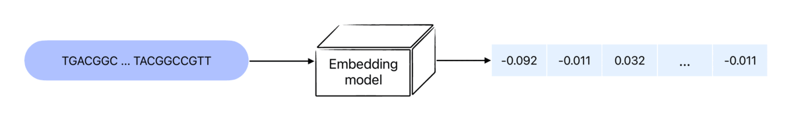

# ntEmbd: Deep learning Embedding for Nucleotide Sequences

 *“Transforming Sequences. Transforming Insight.” — [Embeddy - the Mascot](https://www.saberhq.com/blog/ntembd)*

ntEmbd is a nucleotide sequence embedding method for latent representation of input nucleotide sequences. The model is built on a Bi-LSTM autoencoder architecture to summarize data in a fixed-dimensional latent representation, capturing both local and long-range dependencies between features.

## What are embeddings?
Embeddings refer to numerical representations of concepts that are converted into sequences of numbers, enabling computers to comprehend the relationships between the concepts. Embeddings are widely used in various applications such as search, clustering, recommendations, anomaly detection, diversity measurement, and classification. An embedding is represented as a vector of floating point numbers, where the distance between two vectors is a measure of their relatedness. Smaller distances indicate higher relatedness, while larger distances indicate lower relatedness. This characteristic allows for efficient computation of similarity between concepts in various contexts.

## How ntEmbd words?
ntEmbd is a deep learning embedding method that generates compressed and informative representations for nucleotide sequences. It employs an autoencoder architecture consisting of two main components, an encoder and a decoder:

 The **_encoder_** component of the model takes the input nucleotide sequence and compresses it into a lower-dimensional representation.
 The **_decoder_** component then attempts to reconstruct the original sequence from the compressed representation using additional neural network layers. 

During the training process, the model learns to minimize the difference between the original sequence and the reconstructed sequence, thus capturing the essential features of the input nucleotide sequence in the compressed representation. The learned embeddings can then be used in various downstream tasks such as classification, clustering, and prediction.

## What are applications of learned representations?
The learned representations (embeddings) can be used in various downstream tasks. Here we demonstrate the power of ntEmbd on several bioinformatics applications:

### Coding Potentail Assessment
Using the ntEmbd-generated representations of the RNA sequences and their labels based on the GENCODE biotype classes, we train four supervised classifiers (MLP, Random Forest, KNN, and Gradient Boosting) and utilized an ensemble approach to distinguish coding vs. noncoding transcripts. Our classifier achieved an accuracy of 0.88 on the mRNN-challenge dataset, outperforming five other predictors: RNASamba1 (0.83), mRNN2 (0.87), CPAT3 (0.73), CPC24 (0.69), and FEELnc5 (0.78).

### Full vs. Partial RNA
We further examined the model's performance in discerning full vs. partial-length RNA transcripts and investigated the effect of sequence completeness of transcripts in the training and inference power of the classifier. Our analysis suggests that including both full and partial-length transcripts in training improves classification accuracy compared to using only either type on its own.

### Detecting Adapter Sequences on Nanopore cDNA Reads
Lastly, we applied ntEmbd on detecting adapter sequences on Oxford Nanopore cDNA reads, achieving an accuracy of 0.91, with 0.97 recall and 0.86 precision. For this analysis, we get the learned representaion of Nanopore cDNA reads with and without adapter sequences in them (determined by Pychopper), and then used them to train a supervised classifier. 

We believe that ntEmbd has the potential to be a valuable tool for other sequence classification and clustering tasks when fine-tuned to the specific problem space.

## Youtube video

